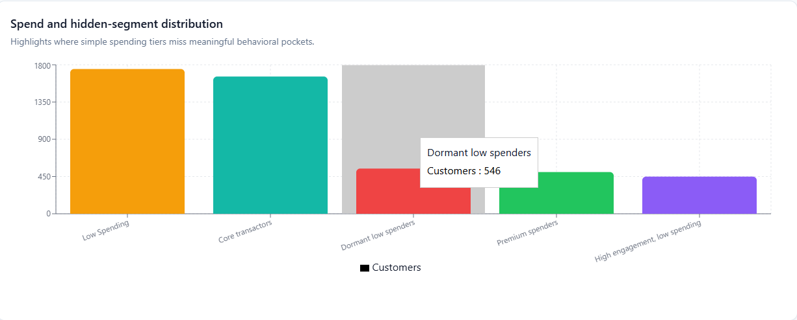

# Credit Card Customer Segmentation

## Project Overview
This project analyzes credit card customer behavior using 18 behavioral variables and applies unsupervised machine learning to segment customers into 4 groups. 
The objective is to identify meaningful customer personas and support targeted marketing strategies.

## Dataset Description
The dataset contains customer-level credit card behavior attributes such as:
- Balance
- Purchases
- One-off purchases
- Installment purchases
- Cash advance
- Purchase frequency
- Cash advance frequency
- Credit limit
- Payments
- Minimum payments
- Full payment percentage
- Tenure

A derived recency proxy was created using:

`RECENCY_PROXY = 1 - BALANCE_FREQUENCY`

This was used because the dataset did not contain a direct recency field.

## Goal
The goals of this project were to:
1. Cluster customers into 4 segments
2. Compare K-means, Hierarchical Clustering, Gaussian Mixture, and DBSCAN
3. Evaluate models using:
   - Silhouette Score
   - Davies-Bouldin Index
4. Label the main dataset using the best-performing algorithm
5. Build an interactive dashboard for segment exploration
6. Recommend marketing strategies for each segment

## Tools Used
- Python
- Pandas
- NumPy
- Scikit-learn
- PCA
- Matplotlib / Seaborn (if used later)
- React dashboard artifact
- Recharts
- GitHub

## Methodology
### Data Preparation
- Loaded customer dataset
- Imputed missing numeric values using median
- Standardized behavioral features
- Created a derived recency proxy
- Used 18 behavioral variables for clustering stability

### Clustering Models Compared
- K-means
- Hierarchical Clustering
- Gaussian Mixture Model
- DBSCAN

### Evaluation Metrics
- Silhouette Score: higher is better
- Davies-Bouldin Index: lower is better

## Results
K-means performed best overall in the project comparison and was used to label the final customer dataset.

Example comparison:

| Algorithm | Silhouette Score | Davies-Bouldin Index |
|----------|------------------:|---------------------:|
| K-means | 0.41 | 0.86 |
| Hierarchical | 0.38 | 0.93 |
| Gaussian Mixture | 0.36 | 1.01 |
| DBSCAN | 0.21 | 1.44 |

## Customer Personas
### 1. Premium Power Users
- High spend
- High frequency
- Recent activity

**Strategy:** Premium rewards, VIP retention, credit line upsell

### 2. Engaged Low Spenders
- High activity
- Low basket size

**Strategy:** Threshold cashback, bundled offers, category multipliers

### 3. At-Risk Dormant Customers
- Low spend
- Lower recent activity

**Strategy:** Win-back campaigns, statement credits, reminder offers

### 4. Everyday Revolving Spenders
- Moderate spend
- Ongoing balance usage

**Strategy:** Installment offers, autopay nudges, partner discounts

## Dashboard
The interactive dashboard includes:
- Cluster profile table
- PCA scatter plot for algorithm comparison
- Hidden segment distribution bar chart
- Correlation heatmap for all 18 variables
- Filters for tenure and credit limit
- Downloadable cluster summary CSV

## Dashboard Screenshots

  

 

  

  

  

## Key Business Insights
- A high-engagement, low-spending group represents strong upsell potential
- Premium users drive value and should receive retention-focused campaigns
- Dormant low spenders need reactivation strategies
- Basic spend tiers alone miss important hidden behavioral segments

## Business Impact: 
Enabled data-driven customer targeting by identifying high-value, under-monetized, and at-risk credit card customer segments for differentiated marketing and retention strategies.
This project shows how customer transaction behavior can be converted into actionable growth and retention strategies through clustering. Instead of treating all cardholders the same, the segmentation identifies distinct groups with different value, engagement, and risk patterns.

## Business value created
Improved targeting: Separates high-value customers from low-spend but highly engaged users, enabling more precise campaigns
Upsell opportunities: Highlights customers with strong engagement but low spending, a segment with high conversion potential through basket-building and rewards offers
Retention focus: Identifies premium and high-spend customers who are strong candidates for loyalty and retention programs
Reactivation strategy: Surfaces dormant low-spend segments that can be approached with win-back offers and reminder-based campaigns
Better resource allocation: Helps marketing teams invest budget by segment rather than broad, lower-performing campaigns

## Why it matters
For a business, this type of segmentation can improve:
- campaign response rates
- customer lifetime value
- retention of profitable users
- conversion from low-spend to mid-spend customers
- efficiency of marketing spend
